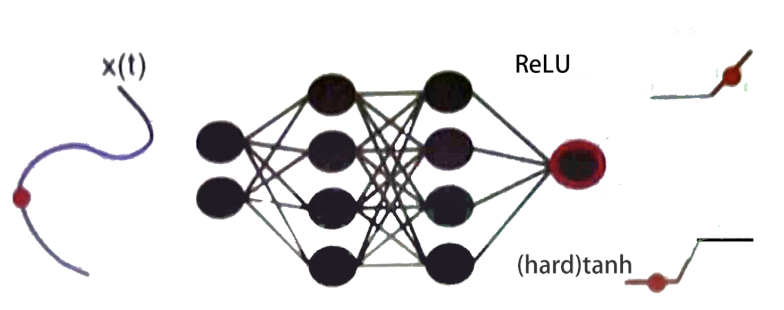
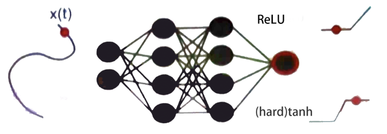
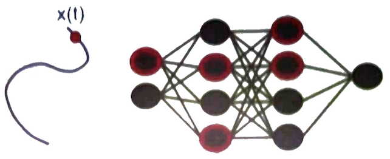
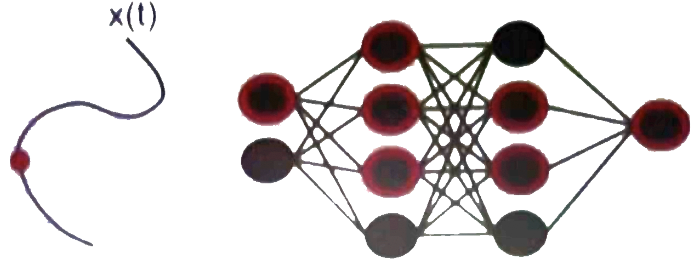
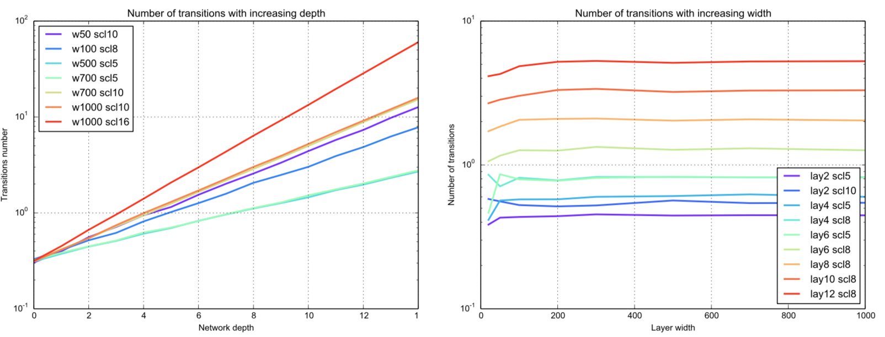

[TOC]

本文结合个人理解，简要梳理《On the Expressive Power of Deep Neural Networks》的内容。这是一篇Maithra Raghu等人发表在2017年的ICML上的文章，并且在会议上做了近20分钟的[展示讲解](https://vimeo.com/237276052)。

## Introduction

论文的题目中有两个关键词：expressive power 和 deep neural network。对expressive power，我们可能会产生的问题有：

 1. 什么是expressive power？
 3. 为什么要研究expressive power？
 2. 如何测量expressive power?
 4. 什么决定了网络的expressive power?
 5. 研究expressive power对理论上神经网络的结构理解，和实际的生产生活应用带来了什么好处？

 本文正是为这些问题提供了解答。

## Expressive power

**神经网络实际上是在拟合一个从输入到输出的函数**。一个确定的神经网络结构$A$对应着一个确定的函数$F_A(x;W)$，其中$x$是输入，$W$是整个
网络中的参数。**对于一个仅使用分段线性激活函数（如：ReLU和hard tanh）的神经网络而言，无论最后拟合出的函数有多么复杂，也一定是一个分段线性函数**。更精确地，
有定理：
> **Theorem 2.** Regions in Input Space. *Given the corresponding function
of a neural network $F_A(\mathbb{R}^m;W)$ with ReLU or hard tanh activations,
 the input space is partitioned into convex polytopes,
 with $F_A(\mathbb{R}^m;W)$ corresponding to a different linear function on each region.*

> **定理 2.** 输入空间区域定理. *一个仅使用ReLU和hard tanh激活函数的神经网络$F_A(\mathbb{R}^m;W)$，会将
输入空间分割成多个凸的多面体。在每一个多面体上，$F_A(\mathbb{R}^m;W)$都对应于一个不同的线性函数。*

**因此，从神经网络的整体结果来看，一个很自然的expressive power的度量就是在某个输入空间上分段线性函数的线性区间的数量。为方便表示说明，这里将输入空间限制为一条一维的路径**。

 

定义输入空间中的一维路径如下：

> **Definition.** Given two points, $x_0, x_1 \in \mathbb{R}^m$, we say $x(t)$ is a trajectory (between $x_0$ and $x_1$
) if $x(t)$ is a curve parametrized by a scalar $t \in [0, 1]$, with $x(0) = x_0$ and $x(1) = x_1$.

> **定义.** 对空间中的两个点 $x_0, x_1 \in \mathbb{R}^m$, 定义$x(t)$为$x_0$ 和 $x_1$ 之间的路径，其中$t \in [0,1]$ 为参数，满足
$x(0) = x_0$ 且 $x(1) = x_1$.

**Montufar 等人的论文中证明了，在同样的参数数量限制下，一个多层全连接网络一定会比一个单层神经网络有更多的线性区间。 本文在这篇论文的基础上，进一步提出使用每一个神经元的可能的激活状态的组合的数目（以下简称：激活状态组合数）来表示网络的expressive power。以relu神经元为例，如图所示，在输入不同的情况下，神经元的激活状态是不同的。** 

 

具体定义如下：
> Define $\mathcal{AP}(F_A(x;W))$ to be the activation pattern – a string of form $\{0, 1\}^\text{num neurons}$ (for ReLUs) and $\{-1, 0, 1\}^\text{num neurons}$ (for hard tanh) of the network encoding the linear region of the activation function of every neuron, for an input $x$ and weights $W$. 
> 
> Define \mathcal{A}(F_A(x(t);W)) as the number of distinct $\mathcal{AP}(F_A(x;W))$ as we sweep $x$ along $x(t)$.

**很自然的问题是：激活状态组合数受到哪些参数的影响？定理1指出，对ReLU神经网络，激活状态组合数的上界为$O(k^{mn})$；对hard tanh网络则为$O((2k)^{mn})$，其中n是网络层数，k是网络宽度，m是输入空间维度。 作者在附录中给出了一页半的证明过程。**

> **Theorem 1**. (Tight) Upper Bound for Number of Activation Patterns *Let $A_{(n,k)}$ denote a fully connected network with $n$ hidden layers of width $k$, and inputs in $\mathbb{R}^m$. Then the number of activation patterns $\mathcal{A}(F_{A_{n,k}}(\mathbb{R}^m;W)$ is upper bounded by $O(k^{mn})$ for ReLU activations, and $O((2k)^{mn})$ for hard tanh.*

**作者在MNIST数据集上验证了这一定理，结果如下图。实验显示，transitions number 随网络深度的增加成指数增加，而随网络宽度的增加在对数坐标轴上并不明显。**

**根据定理1我们可以回答以下问题：当总神经元个数（kn）一定时，如何安排能达到最大的激活状态组合数？经过代入公式求导计算，解得$k=e$为最大值。所以当$k>e$时，网络的expressive power随着每层神经元个数的增加而减小。**